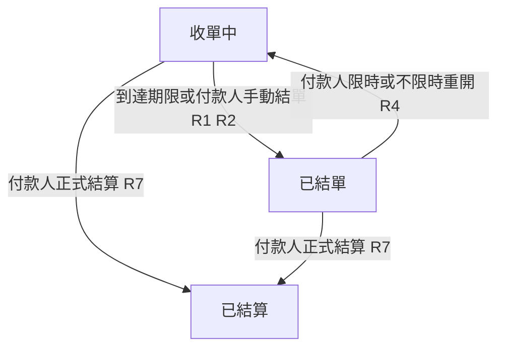
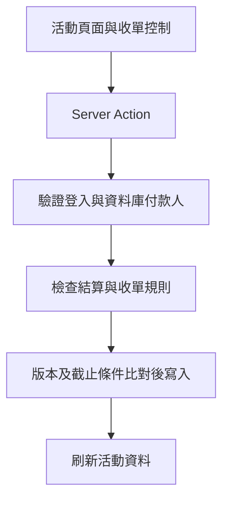

# 活動結單時間與重新開放 - Plan

## Goal Capsule

- **Objective:** 活動到達結單時間後停止接受參加者變更訂單，付款人可視需要重新開放收單。
- **Product authority:** 本文件的 Product Contract 與使用者確認的結單、重開及付款人管理決策。
- **Open blockers:** 無；未逐項討論的相容性與操作預設明列於 Dependencies / Assumptions。

---

## Product Contract

### Summary

活動增加定時結單與手動結單，由現有付款人管理收單。付款人可限時重開或持續開放，再依原有流程正式結算。

### Actors

- A1. 付款人：活動目前指定的統一付款人，也是收單管理者。
- A2. 參加者：付款人以外、使用活動品項登記功能的人。

### Key Decisions

- **結單後鎖定全部品項變更。** Governs R3. (session-settled: user-directed — chosen over only blocking additions: prevent order changes after cutoff)
- **同時提供限時與不限時重開。** Governs R4. (session-settled: user-directed — chosen over a single reopening mode: support both temporary extensions and manual closure)
- **沿用付款人作為管理者。** Governs R1, R6. (session-settled: user-approved — chosen over a separate creator role: use the identity already recorded by the product)
- **結單與正式結算分開。** Governs R7. (session-settled: user-approved — chosen over closing through finalization: preserve the existing accounting process)

### Requirements

**收單與重開**

- R1. 僅目前付款人可設定或變更結單時間、手動結單及重新開放活動。
- R2. 設定結單時間後，系統在目前時間達到或超過該時間時停止收單，即使沒有任何人開啟活動頁面也須生效。
- R3. 活動已結單時，參加者不得新增、修改或刪除任何品項；截止前已開啟的表單在截止後送出也不得成功。
- R4. 付款人重開未結算活動時，可選擇新的未來結單時間，或選擇持續開放直到手動結單。
- R5. 重新開放後，參加者恢復原有品項操作；限時重開在新時間到達時再次依 R2、R3 結單。

**權限與帳務**

- R6. 非付款人不得更換活動付款人以取得管理權限；付款人合法轉交付款人身分後，管理權限隨之移轉。
- R7. 結單不建立正式帳務，正式結算沿用目前流程；已結算活動不能重開或再修改品項。
- R8. 未正式結算前，付款人保留原有品項調整能力，結單限制適用於 R3 所指參加者。

**呈現與相容性**

- R9. 活動詳情應清楚顯示收單中、已結單或已結算，並在有限時收單時顯示明確日期、時間與時區。
- R10. 未設定結單時間的新活動與既有未結算活動維持開放，直到付款人設定截止時間或手動結單。
- R11. 結單或重開只改變收單規則，不刪除既有品項或改動其金額與分攤對象。

### Key Flows

- F1. 定時結單。付款人設定未來結單時間，參加者在截止前登記；截止後依 R2、R3 拒絕變更，並依 R9 顯示狀態。
- F2. 重新開放。付款人依 R4 選擇開放方式，參加者依 R5 恢復操作；到新期限或付款人手動關閉時再次結單。
- F3. 結算。付款人確認品項並沿用原有結算操作，依 R7 進入不可重開的已結算狀態。

### Acceptance Examples

- AE1. **Covers R2, R3.** 結單時間為 12:00；參加者在 11:59 開啟表單，但於 12:00 送出新增、修改或刪除操作，均被拒絕且既有資料不變。
- AE2. **Covers R2, R9.** 無人開啟頁面時已超過結單時間，下一位開啟活動的使用者看到已結單，參加者無法繼續變更品項。
- AE3. **Covers R4, R5, R11.** 已結單活動重開至 12:10，參加者可繼續操作，12:10 起再次鎖定；重開本身不改動既有品項。
- AE4. **Covers R1, R4, R5.** 付款人選擇持續開放，原截止時間不再使活動結單；付款人手動結單後參加者再次無法變更。
- AE5. **Covers R1, R6.** 參加者嘗試重開或將付款人改為自己，皆被拒絕；目前付款人合法轉交後，由新付款人管理收單。
- AE6. **Covers R7.** 未結算活動結單後沒有產生正式交易；付款人正式結算後，任何重開或品項變更均被拒絕。
- AE7. **Covers R8.** 已結單但尚未結算時，付款人仍可修正品項，參加者保持鎖定。
- AE8. **Covers R10.** 既有未結算活動及未設定截止時間的新活動仍可登記，未因上線本功能而自動結單。

### Scope Boundaries

- 不新增活動建立者、管理員或代理管理角色。
- 不改動分攤計算、正式帳務或還款流程。
- 不包含結單通知、重開通知或通知排程。

### Dependencies / Assumptions

- R8 為依原始「限制參加者」範圍採用的預設：付款人可在結單後調整品項，無須為個人修正向所有人重開。
- R10 為相容性預設，避免既有活動在功能上線後意外停止收單。
- R6 的轉交行為沿用現有可更換付款人的能力，但將權限限縮至目前付款人。
- 結單日期時間採用產品一致的時區呈現，預設 Asia/Taipei；新設定及限時重開只接受未來時間，立即停止收單使用手動結單。

### Sources / Research

- `prisma/schema.prisma:93`：活動已記錄付款人、品項、結算狀態與建立／更新時間，尚無獨立活動建立者與結單時間。
- `src/features/auth/auth.service.ts:409`：建立活動沿用指定付款人，未儲存建立者身分。
- `src/features/auth/auth.service.ts:429`：目前未結算活動的更新可變更付款人；此入口須遵守 R6。
- `src/features/auth/auth.service.ts:528`：正式結算目前限定付款人操作。

---

## Planning Contract

### Key Technical Decisions

- KTD1. 使用可為空的結單時間及手動結單時間，與既有 DRAFT／FINALIZED 分開；既有 MongoDB 文件缺少欄位時視為開放。依 R2、R4、R7、R10，不需排程工作或既有資料回填。
- KTD2. 寫入使用 updatedAt 樂觀鎖，連同 DRAFT、目前付款人與收單條件原子比對；一般更新還須帶入頁面讀取時的版本，避免整批品項覆蓋。新增品項使用 push。衝突回傳重新整理提示，不自動重播過期操作。
- KTD3. 收單操作使用獨立 Server Action，只更動收單欄位；一般更新不接受收單欄位。非付款人於結單後的整批更新全部拒絕，避免繞過品項限制。
- KTD4. 日期輸入明示台北時間，轉成包含時區的時間供後端驗證；詳情保留原有五秒刷新，另以計時更新截止狀態，送出時由後端再驗證。

### High-Level Technical Design

以下為責任分工，實際函式切分可依既有程式調整。

狀態轉換依 Product Contract 圖示；寫入條件同時處理權限轉交、結算、手動結單與時間到期。付款人例外只由資料庫當下身分決定，不能依請求的付款人欄位取得例外。

### Risks and Assumptions

- MongoDB 可選欄位須同時涵蓋 null 與不存在；測試需涵蓋舊資料。
- 不連線修改現有資料庫，不執行 db push；本次無索引或必填欄位變更，部署時重新產生 Prisma Client。
- 後端測試以 mock 資料庫驗證拒絕及條件式寫入，不宣稱已完成真實 MongoDB 併發測試。

## Implementation Units

### U1. 收單規則與資料欄位

- **Requirements:** R2、R3、R4、R7、R8、R10。
- **Files:** `prisma/schema.prisma`、`src/features/ledger/domain/event-ordering.ts`、`src/features/ledger/domain/event-ordering.test.ts`。
- **Approach:** 沿用既有 domain 純函式與 Vitest；集中時間驗證、狀態判斷、付款人例外及台北時間轉換。
- **Test scenarios:** 截止前、等於截止、截止後；手動結單；已結算優先；空值與缺欄位；付款人例外；拒絕無效／過去時間。涵蓋 AE1、AE3、AE4、AE6、AE7、AE8。

### U2. 後端收單控制與寫入保護

- **Requirements:** R1 至 R8、R11。
- **Files:** `src/features/auth/auth.service.ts`、`src/features/auth/actions.ts`、`src/features/auth/event-ordering.test.ts`。
- **Approach:** 依 KTD2、KTD3，保護新增與整批更新；詳情回傳收單欄位與伺服器時間；建立時只允許指定為自己的付款人設定期限。
- **Test scenarios:** 參加者逾時新增／修改／刪除被拒；不能冒充付款人；限時與不限時重開不變更品項；已結算不可重開；版本衝突及寫入當下截止條件；付款人轉交。涵蓋 AE1 至 AE8。

### U3. 活動頁面操作與狀態

- **Requirements:** R1、R3、R4、R5、R9、R10。
- **Files:** `src/app/events/[eventId]/page-client.tsx`、`src/app/events/new/page-client.tsx`、`src/app/events/event-ordering-controls.tsx`、`src/app/events/event-ordering-controls.test.tsx`。
- **Approach:** 收單控制採獨立區塊，付款人可選期限或不限時，並手動結單；非付款人鎖住付款人選單，截止後鎖住品項入口與已開啟表單。
- **Test scenarios:** 付款人与參加者看到不同控制；限時輸入與持續開放送出正確動作；失敗顯示錯誤；截止狀態與表單禁用；Asia/Taipei 顯示。涵蓋 F1 至 F3、AE1、AE3、AE4、AE7、AE8。

## Verification Contract

- U1：`bun run test -- src/features/ledger/domain/event-ordering.test.ts`。
- U2：`bun run test -- src/features/auth/event-ordering.test.ts`。
- U3：`bun run test -- src/app/events/event-ordering-controls.test.tsx`，另檢查詳情頁的所有新增、修改、刪除入口。
- 全體：`bun run db:generate`、`bun run test`、`bunx tsc --noEmit`、`git diff --check`。
- Browser QA 依專案現行限制與可用登入／測試環境執行；若無可用環境，明列未驗證項目，以元件測試補足，不對現有帳務建立測試資料。

## Definition of Done

- R1 至 R11 均有實作與對應驗收證據，既有帳務計算測試通過。
- 權限、截止瞬間、舊頁面與舊資料情境均受後端保護。
- 完成程式審查，修正可確認的問題，PR 說明測試與環境限制。
